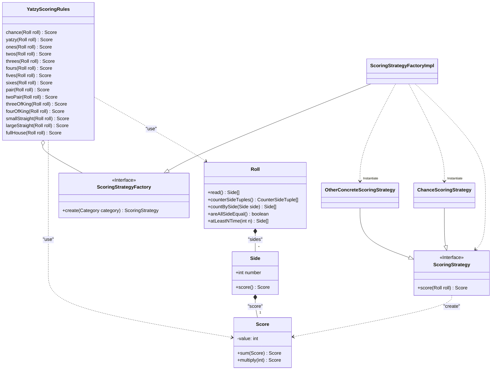

# Yatzy kata refactoring
This refactoring is about the logic that scores a GIVEN roll in a GIVEN category. 
It does not implement the whole game with the actions of random rolling and placing a score into a category.

## Yatzy description

_The game of Yatzy is a simple **dice** game. Each **player** **rolls** five **six-sided** dices._ 
_They can **re-roll** some or all of the dices up to three times (including the original roll)._

_The player then **places** the roll in a **category**, such as **ones**, **twos**, **fives**, **pair**, **two pairs** etc (see the rules below). If the roll is compatible with the category, the player gets a score for the roll according to the rules. If the roll is not compatible with the category, the player scores zero for the roll._

_For example, suppose a player **scores** 5,6,5,5,2 in the fives category they would score 15 (three fives)._ 
_The score for that go is then added to their total and the category cannot be used again in the remaining goes for that game._ 
_A full game consists of one go for each category. Thus, for their last go in a game, a **player** must choose their only remaining category._

## Ubiquitous language
- **Side**: side of a dice, a side has a number representing the value of the side.
- **Roll**: dice Sides that are read.
- **Category**: the player can place a Score in a category, categories are: 
  - Chance
  - Yatzy
  - Side categories : Ones, Twos, Threes, Fours, Fives, Sixes
  - N of a Kind categories : Three of a kind, Four of a kind
  - Straight categories: Small straight, large straight
  - Pair
  - Two Pairs
  - Full house
- **Score**: score returned for a given category. Or score represented by a dice side.
- **Dice**: Not used in this refactoring.
- **Player**:  Not used in this refactoring.
- **Game**:  Not used in this refactoring.

## Problems with initial code
- Yatzy is a God object because it handles the logic for all categories. And does not respect the Single Responsibility Principal.
- There is a lot of copy/paste code, that doesn't respect the Don't Repeat Yourself principal
- Both dice value and score are primitive int. This is the Primitive obsession problem which is not an object oriented programming. 
- Scores are returned as Magic Numbers, this makes the code hard to read and difficult to refactor.

All those problems lead to a code that is difficult to read, to maintain. 

## SOLID and DRY Solutions
- To avoid God object anti-pattern, I split the scoring rules into several Classes by implementing the Strategy design pattern.
- To avoid code duplication anti-pattern, I use abstraction between rules that can share code.
- To avoid Primitive obsession anti-pattern, I create Value object classes that wrap the primitive value and are named accordingly to the ubiquitous language.
- To avoid Magic Numbers anti-pattern, I create constants with explicit name.

## Refactoring approach

1. Ensure that the current code is properly tested and all use cases are covered.
2. Choose one category method to refactor as a strategy implementation and use Test Driven Development approach to implement the strategy.
Don't implement code that is not yet require yet, and follow the KISS principal.
4. Use the new code in a new method in Yatzy and mark the old method as Deprecated.
4. Refactor the code when possible to remove code duplication or improve the readability.
5. Once the new implementation is stable, remove the old code to avoid any lava flow anti-pattern.
6. Iterate, on the next category method.

## Class diagram after refactoring

